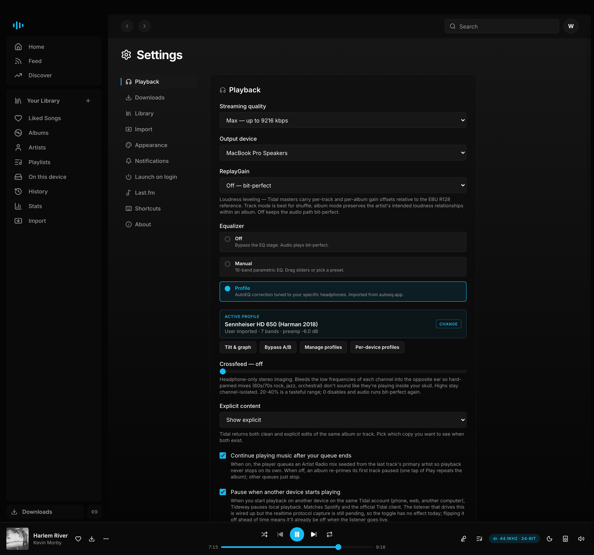
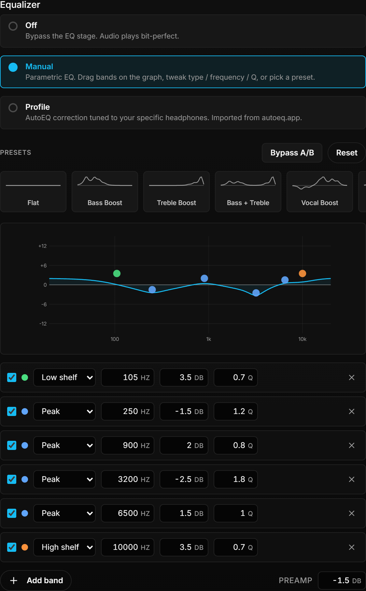
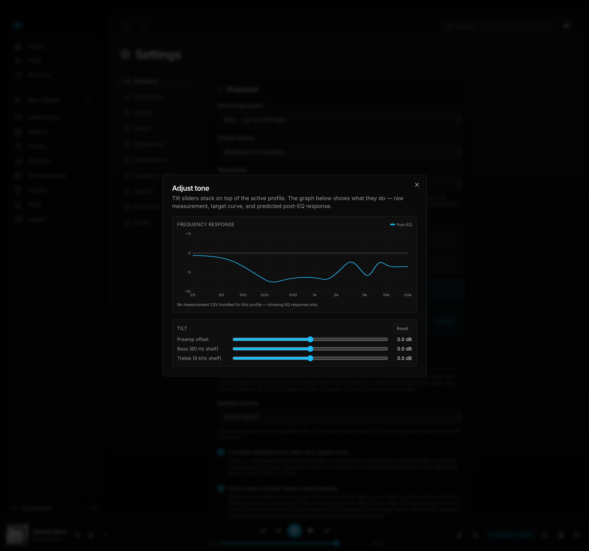

# Tideway

The native desktop client for Tidal. Bit-perfect gapless playback,
hi-res downloads, a real parametric EQ, and your listening history
from Last.fm and Spotify, in one app with no web bloat. It packages
a FastAPI backend, a React and Tailwind frontend, and a PyAV and
sounddevice audio engine behind a single pywebview window.

> ### About your Tidal account
>
> This app is not made by Tidal. It talks to the same private
> endpoints the official Tidal apps use, but with traffic patterns
> that can look unusual to Tidal's anti-abuse system. Heavy use,
> especially mass downloads or rapid browsing, has triggered both
> soft rate limits and longer "abuse detected" cooldowns.
>
> A soft rate limit pauses playback and search for about a minute.
> The abuse-detected variant pauses everything for thirty minutes
> and counts as a strike. Repeated strikes can escalate to account
> suspension or a permanent ban.
>
> The app throttles itself in normal use and surfaces a banner the
> moment a backoff engages, but you are using your own account at
> your own risk. If you cannot accept any chance of a Tidal action
> against your account, do not use this app.

<!-- TODO: replace the screenshot below with a 20-30s demo GIF
     (play a track with the signal-path readout, open the EQ, queue
     an album download at Max) and save it as
     assets/screenshots/demo.gif. A short clip converts far better
     than a static shot for every channel we'd post this on. -->


**[Download for macOS, Windows, or Linux »](../../releases/latest)**

## Contents

- [What's inside](#whats-inside)
- [Support](#support)
- [Install a released build](#install-a-released-build)
  - [Why the OS warns you on first launch](#why-the-os-warns-you-on-first-launch)
- [Stack](#stack)
- [Run it from source](#run-it-from-source)
  - [Dev mode (browser)](#dev-mode-browser)
  - [Desktop window (packaged shell)](#desktop-window-packaged-shell)
- [Layout](#layout)
- [Notes](#notes)
- [Known limits](#known-limits)
- [Building a distributable](#building-a-distributable)
  - [Icons (once)](#icons-once)
  - [macOS](#macos)
  - [Windows](#windows)
  - [Linux](#linux)
  - [Auto update](#auto-update)
- [Contributing](#contributing)
- [License](#license)

## What's inside

**Playback.** Audio plays through a pipeline built on PyAV for
decode and sounddevice for output. Tracks hit the OS audio API at
their native sample rate and bit depth. There is no resampling and
no hidden software mixer. Transitions between tracks at the same
sample rate splice at the PCM sample boundary, so they are truly
gapless. Transitions that change sample rate reopen the output
stream and bridge across roughly fifty milliseconds, which is the
same limitation Tidal desktop and foobar2000 have.

A parametric equalizer runs in three modes. **Off** bypasses the
EQ stage entirely, leaving the audio bit-perfect. **Manual** is a
full parametric EQ: every band carries its own filter type (peaking,
low shelf, or high shelf), frequency, gain, and Q, and you add or
remove bands freely. You shape them on a live frequency-response
graph — drag a node to set frequency and gain, scroll over it to
tighten or widen its Q, double-click empty space to drop a new band
or a node to delete it — or type exact values in the per-band rows.
The curve redraws in real time as you drag, computed with the same
RBJ biquad math the audio engine runs. A fresh install seeds six
flat bands so there's something to grab, and flat bands compile to
nothing, so the audio stays bit-perfect until you actually shape
one. Presets render as miniature response curves, a master preamp
keeps headroom for boosts, and an A/B bypass flips the whole EQ off
and on without losing your bands. **Profile** loads a per-headphone
[AutoEQ](https://github.com/jaakkopasanen/AutoEq) correction file
so your headphones target neutral, Harman, or B&K. Profiles are
user-imported (`ParametricEQ.txt` from AutoEQ or `.txt` from
Equalizer APO), with optional bass, treble, and preamp tilt
sliders stacked on top, an A/B bypass to compare on the fly, a
frequency-response graph that visualises the cumulative shape,
and per-device profile mapping so different headphones plugged
into different DACs each apply their own correction
automatically. See [docs/eq-and-autoeq.md](docs/eq-and-autoeq.md)
for the full guide.

Three more optional stages sit in Settings under Playback, all off
by default so the path stays bit-perfect until you reach for them.
**Crossfeed** bleeds a little of each channel into the opposite ear
through a Bauer-style 700 Hz split, which pulls hard-panned mixes
out of the middle of your skull and closer to a speaker soundstage.
**ReplayGain** loudness leveling smooths the volume jumps between
tracks using the EBU R128 numbers Tidal already ships and that
downloaded files carry in their tags, with per-track and per-album
modes. A **Signal Path** readout shows exactly what is happening to
the audio right now, from source bit depth and sample rate through
each active stage to the output device, so you can confirm a stream
really is bit-perfect.







The output device picker lists every USB DAC,
Bluetooth sink, and builtin option the OS exposes, plus Chromecast
targets, Tidal Connect renderers, and UPnP/DLNA devices discovered
on the LAN. You can switch between any of them mid playback. The
DLNA path covers WiiM, newer Bluesound, Cambridge, NAD, most
network AVRs, and a long tail of cheaper Hi-Fi network bridges.
See [docs/dlna-renderer.md](docs/dlna-renderer.md) for the
DLNA-side details. Global media keys for play, pause, next, and previous
work even when the window is minimized. There is an opt-in desktop
notification on every track change. On Linux, Tideway registers as
an MPRIS player on the session bus, so GNOME and KDE media widgets,
the lock screen, and `playerctl` can see the current track and
drive playback. On macOS the same job is done through the native
Now Playing integration in Control Center.

**Browsing and library.** Search, a unified Charts page (Popular,
Top, Rising, and New Releases as tabs), and dedicated album,
artist, playlist, and mix pages are all there. The Home page also
surfaces two AlbumOfTheYear-backed discovery rows, a top-of-year
highlight reel and a new-releases row, so you can find music that
isn't already in heavy rotation. Both open into full pages where
you can filter by genre, so pulling up the year's best ambient or
this week's new metal is one dropdown away, with the data credited
back to AlbumOfTheYear. Album, artist, playlist, and mix pages have
Play, Shuffle, and a More menu. Artist pages keep compilations in
their own section instead of mixing them into the studio albums,
and lead with a Latest releases row. Albums also show a
quality badge that reflects the best version Tidal has in its
catalog. That includes Max, Lossless, Dolby Atmos, and 360
Reality Audio, though see the limits section below for what the
app can actually stream. Playlists can be created, edited,
reordered, and extended. Any track in the app has an "Add to
playlist" action attached to it. There are dedicated radio pages
for artists and tracks. The Stats page is backed by Last.fm and
surfaces your top tracks, artists, and albums, along with a
listening activity chart that responds to period filters.


**Data enrichment.** Last.fm powers scrobbling and per-user or
global playcounts on every track, album, and artist page. Spotify
contributes a separate layer of public data through its anonymous
GraphQL endpoint. This includes track playcounts, artist monthly
listeners, and top listening cities. The two services complement
each other. Last.fm gives you your own history, and Spotify fills
in the global popularity signal.


**Downloads.** The file format follows the quality tier. High and
Max are lossless and download as FLAC. Tidal delivers that FLAC
inside an MP4, so Tideway remuxes it into a native `.flac` file.
Low and Medium are lossy AAC and download as `.m4a`, which is the
standard AAC container, not a deprecated format. Music videos
download as well. Everything runs through a concurrent queue that
you can tune. Metadata and artwork are embedded with mutagen. Any track you have downloaded
plays straight from disk without touching the Tidal streaming
path. A filename template, toggles for per-album and per-playlist
folders, and a skip-existing option cover the common download
preferences. A downloaded playlist lands in a folder named after
the playlist and is numbered in playlist order rather than by
album track number, and the template understands `{playlist_num}`
and `{playlist}` alongside the usual title, track, album, and
artist tokens.


**On this device.** Everything you've downloaded is browsable from
a dedicated page that reads tags directly off disk. Music groups
by album (or by artist, or sorted by date added), and videos sit
on their own tab. Tracks play locally without round-tripping
through Tidal's streaming endpoints, so they keep working offline
and don't count toward any per-day stream cap.


**Import.** You can transfer playlists from Spotify using PKCE
OAuth, which requires a Spotify Developer client id that you
supply yourself. There is also support for Deezer and for plain
M3U or text lists. Liked songs, saved albums, and followed artists
all mirror across.

**Video.** Music videos play through native HLS, powered by hls.js
with a CORS proxy that keeps things working inside the Chromium
based WebView the packaged app uses. Picture in picture,
fullscreen, a quality picker, and subtitle toggles are all
supported.

**Tidal attribution.** Every track you play fires a playback
session event at Tidal's event producer bus, in the exact wire
format the official tidal-sdk-web uses. That means plays credit
the artist and surface in your Tidal Recently Played. There is a
diagnostic panel under Settings that shows the outgoing events and
the status Tidal returned for each one.

**Updates.** On launch the app checks GitHub Releases. When a
newer version is available a banner surfaces across the top of the
UI, and clicking Install downloads the right asset for your OS and
runs it.

## Support

If Tideway is useful to you and you'd like to support its
development, you can [buy me a coffee on Ko-fi](https://ko-fi.com/jmpunk).
Tideway is free and will stay that way; donations are appreciated
but never expected.

[](https://ko-fi.com/jmpunk)

## Install a released build

Grab the latest from the Releases page for whichever fork of this
repo you are installing from.

On macOS, download `Tideway-<version>.dmg`, double-click it, and
drag the `Tideway` app into `/Applications`. Apple Silicon only:
the binary is arm64-native and won't launch on Intel Macs. This
has been the case since the earliest signed release; the README
just hadn't called it out before.

On Windows, download `Tideway-setup-<version>.exe` and run it. The
installer drops the app under your user profile, registers a Start
Menu entry, and offers an optional desktop shortcut.

On Linux, the recommended install is the Flatpak. It bundles GTK
and WebKit2GTK from the GNOME 49 runtime so the app gets a real
native window without any host-package fiddling, and `flatpak
update` keeps it current.

```sh
# Subscribe to the auto-updating repo (one-time)
flatpak remote-add --user --if-not-exists tideway \
  https://j-m-punk.github.io/tideway/tideway.flatpakrepo

# Install
flatpak install --user tideway com.tidaldownloader.Tideway

# Run
flatpak run com.tidaldownloader.Tideway

# Update later
flatpak update --user com.tidaldownloader.Tideway
```

If you'd rather not subscribe to a remote, download
`Tideway-<version>.flatpak` from the latest release and install the
single-file bundle:

```sh
flatpak install --user --bundle Tideway-<version>.flatpak
```

The bundle won't auto-update — grab a newer one from the release
page when you want to upgrade.

> Global media keys require an X11 session (Wayland will degrade —
> the player still works, the global hotkeys do not). ARM Linux
> (Raspberry Pi etc.) is not built today.
>
> If you were running the v1.10.x or earlier AppImage, install the
> Flatpak with the commands above to keep getting updates. The
> AppImage build was retired in v1.11.0 because it had no native
> window and fell back to opening the app in the system browser.

### Why the OS warns you on first launch

The builds are not code signed. Signing costs 99 dollars a year
from Apple and upwards of 200 dollars a year from Microsoft, which
is not a cost worth paying for an open source hobby project. Both
operating systems show one scary looking warning the first time
you open an unsigned app. After that they remember the choice and
the warning never comes back.

On macOS, right click (or Control click) the `.app`, pick **Open**,
and confirm **Open** in the dialog that appears.

On Windows, click **More info** in the SmartScreen dialog, then
**Run anyway**.

The Linux Flatpak doesn't carry a Gatekeeper-style first-launch
warning; the sandbox is the trust boundary.

If you would rather verify the build yourself, clone the repo and
follow **Run it from source** below. PyInstaller produces the same
macOS / Windows bundle you download from Releases; the Linux
Flatpak is built with `flatpak-builder` against the manifest at
`flatpak/com.tidaldownloader.Tideway.yaml`.

## Stack

The backend runs on FastAPI with tidalapi and mutagen. All mutable
state, which includes your settings, your Tidal session, the
download queue, and the Spotify and Last.fm caches, lives in a
per-user app data directory.

The audio engine is PyAV for demuxing and decoding (libav is
bundled inside the Python wheel), sounddevice for output, and
scipy for the equalizer biquad cascade.

The frontend is Vite, React, TypeScript, Tailwind CSS, and a set
of shadcn style primitives, with React Router handling navigation
and React.lazy splitting each route into its own chunk. Realtime
updates flow over Server Sent Events, both for player state and
for download progress.

The desktop shell is pywebview, which uses WKWebView on macOS and
WebView2 on Windows. Global media keys are delivered by pynput.

## Run it from source

First time setup:

```bash
python3 -m venv .venv
.venv/bin/pip install -r requirements.txt
(cd web && npm install)
```

### Dev mode (browser)

For day-to-day frontend work, start FastAPI and Vite together:

```bash
./run.sh
```

The FastAPI server listens on <http://127.0.0.1:8000> and serves
the JSON API and `/docs`. The Vite dev server is on
<http://127.0.0.1:5173>. Hot module reload picks up frontend
changes instantly.

### Desktop window (packaged shell)

Anything that depends on the native pywebview window (macOS chrome,
window drag, traffic lights, global media keys) only exercises in
the desktop shell. To launch it from source:

```bash
(cd web && npm run build)
.venv/bin/python desktop.py
```

`desktop.py` serves whatever is in `web/dist/`, so rebuild the
frontend any time you change React code or the desktop window will
show stale UI.

On first launch, click **Login with Tidal**. The login uses PKCE.
Paste the redirect URL back into the app and Tideway exchanges it
for a session that's entitled for hi-res streaming. The session
and every other piece of app data live in the per-user data
directory. On macOS that's
`~/Library/Application Support/Tideway`. On Windows it's
`%APPDATA%\Tideway`. On Linux it's `~/.local/share/Tideway`.

## Layout

```
app/                shared Python logic: tidal client, downloader,
                    metadata, play reporting, Spotify and Last.fm
                    clients
app/audio/          audio engine: decoder, segment reader, player,
                    equalizer, gapless splicing, Cast and DLNA
                    output
server.py           FastAPI entry point
desktop.py          pywebview shell, which is the entry point for
                    the packaged app
web/                Vite and React frontend
run.sh              one command dev launcher
Tideway-mac.spec    PyInstaller spec for macOS
Tideway-win.spec    PyInstaller spec for Windows
flatpak/            Flatpak manifest + generated deps for Linux
scripts/            build helpers: icons, DMG, Inno Setup .iss
tests/              pytest suite
.github/workflows/  CI (test.yml) and release pipeline (release.yml)
```

## Notes

No external binaries are required. Audio and video are both
handled by PyAV, which ships libav inside its Python wheel, so
there is never a reason to install ffmpeg or VLC on the side.

Your settings live in `settings.json` in the per-user data
directory. You can edit everything from the Settings page inside
the app. Your last volume and the window's size and position are
remembered there too, so a relaunch comes back the way you left
it.

Spotify enrichment works anonymously out of the box and needs no
login. The Spotify importer is different. It needs a Spotify
Developer client id, which you paste into Settings > Import. Last.fm
enrichment uses a bundled API key; connecting your own Last.fm
account is optional, and you only need to do it if you want
scrobbling and your own per-user playcounts.

## Known limits

**Dolby Atmos, 360 Reality Audio, and MQA do not play or download
in this app.** Tidal only serves those immersive streams to a
short list of certified partner devices. The PKCE client id we
ship with is the Android Automotive one that tidalapi exposes, and
it is not on that list. Every streaming request we make comes back
as a stereo FLAC downmix, even on albums that advertise Atmos or
360 in their catalog metadata. The quality badge on album pages
still shows those tags, because knowing that the immersive version
exists on Tidal itself is useful information to have.

This is a choice, not a hard wall. Other projects such as
[Dniel97/RedSea](https://github.com/Dniel97/RedSea) do support
Atmos downloads by signing in with client ids and secrets
extracted from specific Android TV or mobile apps that do have the
immersive entitlement. We chose not to go down that road. It
means impersonating a certified partner device, which is a
different category of Tidal ToS violation than simply using the
public PKCE flow. The client ids involved get revoked periodically
and have to be re-extracted, which turns a shipped feature into a
running maintenance burden. And Atmos playback on a desktop needs
either a Dolby-capable renderer on the OS side or a receiver on
the other end of HDMI, which most setups do not have. If any of
that changes, we can revisit.

**Network audio output is mostly there, with caveats.**
Chromecast, Tidal Connect, and UPnP/DLNA all ship in the output
device picker.

The DLNA path in particular has not been bench-tested against
real renderers. The unit tests cover the SOAP wrappers, session
lifecycle, and audio plumbing, but device-side behaviour (does
your specific WiiM accept the FLAC stream, does pause respond
fast, does the device cleanly disconnect when you switch) is
unverified. If you hit a renderer that misbehaves, please file a
GitHub issue with the device's manufacturer and model and any
log output from the diagnostic panel.

**Play reporting to Tidal Recently Played is best effort.** Every
play fires a `playback_session` event at Tidal's event producer
bus in the exact wire format the official SDK uses, and the bus
accepts the event. Whether it surfaces in Recently Played on the
official Tidal app depends on whether the play_log consumer
accepts events from our client id. Sometimes it does and
sometimes it does not. The Settings page has a diagnostic panel
that shows every event we send along with the status Tidal
returned for it.

**The builds are not code signed.** First launch will trigger a
Gatekeeper warning on macOS and a SmartScreen warning on Windows.
See the install section above for the one time steps to get past
them.

## Building a distributable

### Icons (once)

Drop a 1024 by 1024 PNG at `assets/icon-source.png`, then run:

```
scripts/build_icons.sh
```

That produces `assets/icon.icns` for macOS and `assets/icon.ico`
for Windows. Both PyInstaller specs look for those files. If they
are missing the build ships a generic placeholder icon.

### macOS

```
npm --prefix web run build
.venv/bin/pyinstaller Tideway-mac.spec --noconfirm
scripts/build_dmg.sh
```

The DMG lands at `dist/Tideway-<version>.dmg`. Users drag the
`.app` into Applications and launch. The CI builds on macOS 14
(Apple Silicon), so the DMG produced by the release workflow is
arm64. Intel Mac builds aren't part of the release pipeline today.

### Windows

```
npm --prefix web run build
.venv\Scripts\pyinstaller Tideway-win.spec --noconfirm
"C:\Program Files (x86)\Inno Setup 6\ISCC.exe" scripts\Tideway.iss
```

The installer lands at `dist/Tideway-setup-<version>.exe`. Users
run it and walk through Next, Next, Install. The release pipeline
builds both an x64 and an arm64 installer (Windows 11 ARM64
runner), and the auto-updater picks the right one for the user's
machine.

### Linux

Linux ships as a Flatpak built against the GNOME 49 runtime
(Python 3.13, GTK 3, WebKit2GTK 4.1). The PyInstaller-frozen
AppImage path was retired in v1.11.0 — it couldn't import the
host's PyGObject / WebKit2GTK and pywebview fell back to opening
the app in the system browser.

```
# One-time: install flatpak + flatpak-builder + GNOME 49 runtime
sudo apt-get install flatpak flatpak-builder ostree elfutils
flatpak remote-add --user --if-not-exists \
  flathub https://flathub.org/repo/flathub.flatpakrepo
flatpak install --user -y flathub \
  org.gnome.Platform//49 org.gnome.Sdk//49 \
  org.freedesktop.Sdk.Extension.node20//25.08

# Build
flatpak-builder --user --ccache --force-clean \
  --repo=repo .build-flatpak \
  flatpak/com.tidaldownloader.Tideway.yaml

# Install locally
flatpak-builder --user --install --force-clean \
  .build-flatpak flatpak/com.tidaldownloader.Tideway.yaml
flatpak run com.tidaldownloader.Tideway
```

See [docs/linux-flatpak.md](docs/linux-flatpak.md) for the full
architecture, the `--prefer-wheels` / `flatpak-node-generator`
trade-offs, and the GPG-signing setup.

### Auto update

The app hits the GitHub Releases API at `/api/update-check` once
per launch and caches the result for an hour. When a newer tag is
out a banner surfaces across the top of the UI. Clicking **Install
now** downloads the correct asset for the user's OS and architecture
from the latest release, opens it, and quits the app so the installer
can replace the bundle.

The release asset names must match these patterns:

```
Tideway-<version>.dmg                       (macOS, Apple Silicon)
Tideway-setup-<version>.exe                 (Windows x64)
Tideway-setup-<version>-arm64.exe           (Windows ARM64)
Tideway-<version>.flatpak                   (Linux Flatpak bundle)
```

The auto-updater also detects when it's running inside a Flatpak
sandbox and points the user at `flatpak update` instead of trying
to install a bundle the running app can't replace.

Cutting a release is a tag push, not a manual `gh release create`.
See [CONTRIBUTING.md](CONTRIBUTING.md) for the full release flow:
deploy branch, preflight, tag, draft release review, publish.

## Contributing

PRs welcome. Read [CONTRIBUTING.md](CONTRIBUTING.md) before
opening one. The short version: branch off `main` with a
`fix/`, `feature/`, or `chore/` prefix, run the four pre-PR
checks (`pytest`, `tsc`, `lint`, `vitest`) locally, open a PR
against `main`. Bug reports and feature requests go in
[GitHub Issues](https://github.com/J-M-PUNK/tideway/issues).

## License

[MIT](LICENSE).
