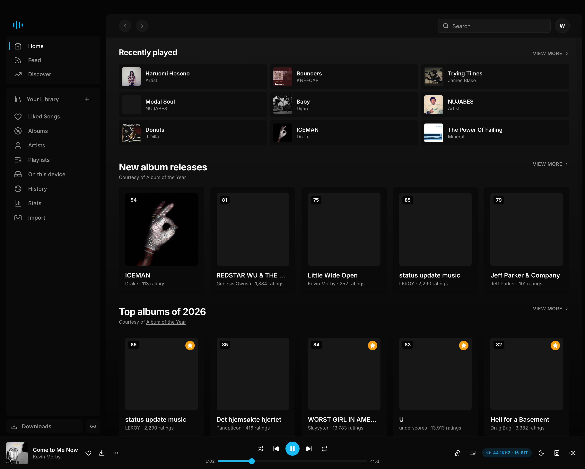
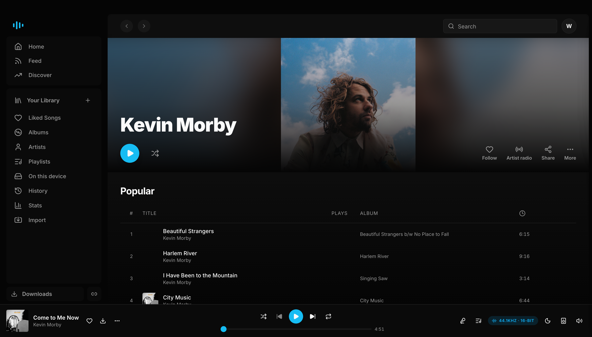
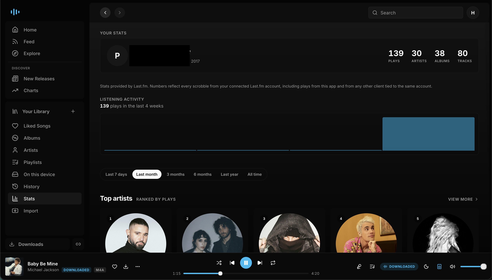
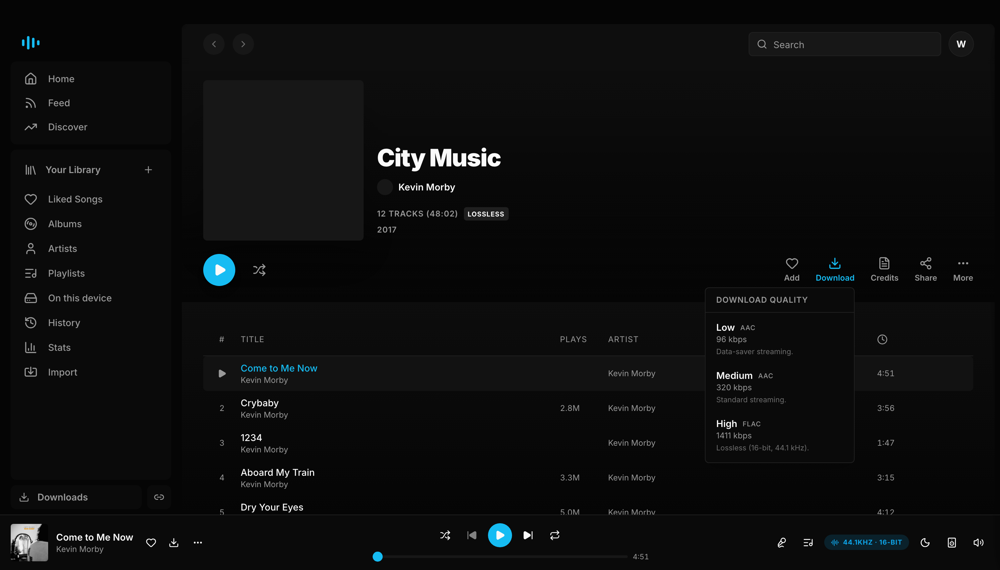
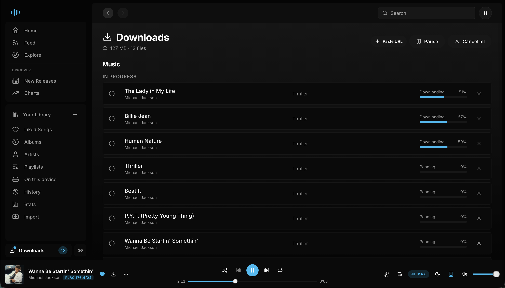
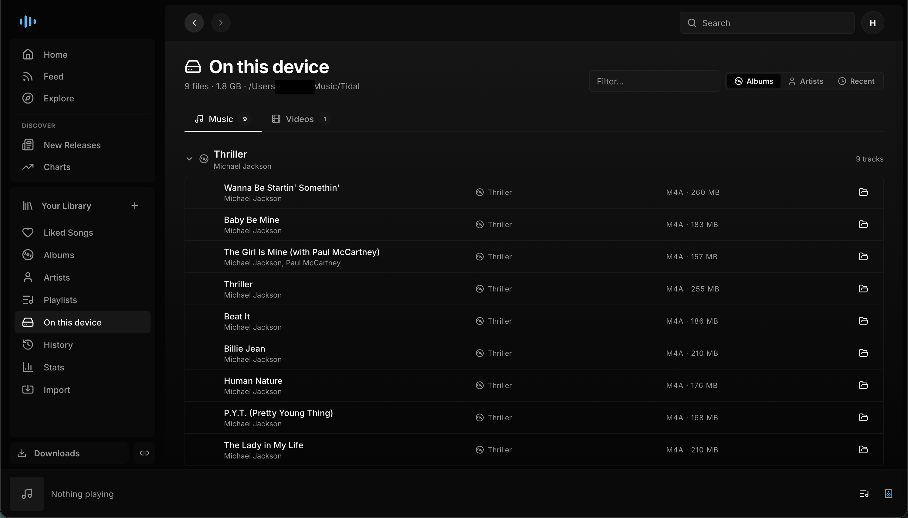
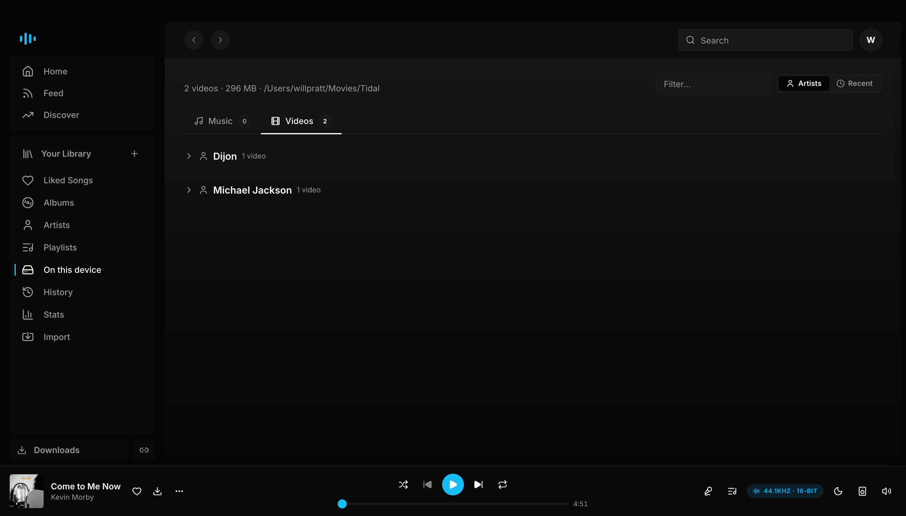

# Tideway

TIDAL BUT BETTER. NO BLOAT WITH THE ABSOLUTE MOST.

The ultimate desktop client for Tidal. Bit perfect gapless playback,
hi-res downloads, listening data from Last.fm and Spotify, full
library management, and more. Everything ships in one native
feeling desktop app that packages a FastAPI backend, a React and
Tailwind frontend, and a PyAV and sounddevice audio engine behind
a single pywebview window.

> ### About your Tidal account
>
> This app is not made by Tidal. It talks to the same private
> endpoints the official Tidal apps use, but with traffic patterns
> that can look unusual to Tidal's anti-abuse system. Heavy use,
> especially mass downloads or rapid browsing, has triggered both
> soft rate limits and longer "abuse detected" cooldowns.
>
> A soft rate limit pauses playback and search for about a minute.
> The abuse-detected variant pauses everything for thirty minutes
> and counts as a strike. Repeated strikes can escalate to account
> suspension or a permanent ban.
>
> The app throttles itself in normal use and surfaces a banner the
> moment a backoff engages, but you are using your own account at
> your own risk. If you cannot accept any chance of a Tidal action
> against your account, do not use this app.



## What's inside

**Playback.** Audio plays through a pipeline built on PyAV for
decode and sounddevice for output. Tracks hit the OS audio API at
their native sample rate and bit depth. There is no resampling and
no hidden software mixer. Transitions between tracks at the same
sample rate splice at the PCM sample boundary, so they are truly
gapless. Transitions that change sample rate reopen the output
stream and bridge across roughly fifty milliseconds, which is the
same limitation Tidal desktop and foobar2000 have.

A 10 band parametric equalizer is available with presets and a
preamp. The output device picker lists every USB DAC, Bluetooth
sink, and builtin option the OS exposes, and you can switch mid
playback. Global media keys for play, pause, next, and previous
work even when the window is minimized. A tray icon keeps playback
running when you close the window, and there is an opt-in desktop
notification on every track change.

**Browsing and library.** Search, Explore, Charts, and New
Releases pages are all there. Album, artist, playlist, and mix
pages have Play, Shuffle, and a More menu. Albums also show a
quality badge that reflects the best version Tidal has in its
catalog. That includes Max, Lossless, Dolby Atmos, and 360
Reality Audio, though see the limits section below for what the
app can actually stream. Playlists can be created, edited,
reordered, and extended. Any track in the app has an "Add to
playlist" action attached to it. There are dedicated radio pages
for artists and tracks. The Stats page is backed by Last.fm and
surfaces your top tracks, artists, and albums, along with a
listening activity chart that responds to period filters.



**Data enrichment.** Last.fm powers scrobbling and per-user or
global playcounts on every track, album, and artist page. Spotify
contributes a separate layer of public data through its anonymous
GraphQL endpoint. This includes track playcounts, artist monthly
listeners, and top listening cities. The two services complement
each other. Last.fm gives you your own history, and Spotify fills
in the global popularity signal.



**Downloads.** Hi-res stereo FLAC and music video downloads all
run through a concurrent queue that you can tune. Metadata and
artwork are embedded with mutagen. Any track you have downloaded
plays straight from disk without touching the Tidal streaming
path. A filename template, a toggle for per album folders, and a
skip existing option cover the common download preferences.





**On this device.** Everything you've downloaded is browsable from
a dedicated page that reads tags directly off disk. Music groups
by album (or by artist, or sorted by date added), and videos sit
on their own tab. Tracks play locally without round-tripping
through Tidal's streaming endpoints, so they keep working offline
and don't count toward any per-day stream cap.





**Import.** You can transfer playlists from Spotify using PKCE
OAuth, which requires a Spotify Developer client id that you
supply yourself. There is also support for Deezer and for plain
M3U or text lists. Liked songs, saved albums, and followed artists
all mirror across.

**Video.** Music videos play through native HLS, powered by hls.js
with a CORS proxy that keeps things working inside the Chromium
based WebView the packaged app uses. Picture in picture,
fullscreen, a quality picker, and subtitle toggles are all
supported.

**Tidal attribution.** Every track you play fires a playback
session event at Tidal's event producer bus, in the exact wire
format the official tidal-sdk-web uses. That means plays credit
the artist and surface in your Tidal Recently Played. There is a
diagnostic panel under Settings that shows the outgoing events and
the status Tidal returned for each one.

**Updates.** On launch the app checks GitHub Releases. When a
newer version is available a banner surfaces across the top of the
UI, and clicking Install downloads the right asset for your OS and
runs it.

## Support

If Tideway is useful to you and you'd like to support its
development, you can [buy me a coffee on Ko-fi](https://ko-fi.com/jmpunk).
Tideway is free and will stay that way; donations are appreciated
but never expected.

[](https://ko-fi.com/jmpunk)

## Install a released build

Grab the latest from the Releases page for whichever fork of this
repo you are installing from.

On macOS, download `Tideway-<version>.dmg`, double-click it, and
drag the `Tideway` app into `/Applications`.

On Windows, download `Tideway-setup-<version>.exe` and run it. The
installer drops the app under your user profile, registers a Start
Menu entry, and offers an optional desktop shortcut.

### Why the OS warns you on first launch

The builds are not code signed. Signing costs 99 dollars a year
from Apple and upwards of 200 dollars a year from Microsoft, which
is not a cost worth paying for an open source hobby project. Both
operating systems show one scary looking warning the first time
you open an unsigned app. After that they remember the choice and
the warning never comes back.

On macOS, right click (or Control click) the `.app`, pick **Open**,
and confirm **Open** in the dialog that appears.

On Windows, click **More info** in the SmartScreen dialog, then
**Run anyway**.

If you would rather verify the build yourself, clone the repo and
follow **Run it from source** below. PyInstaller produces the same
bundle you download from Releases.

## Stack

The backend runs on FastAPI with tidalapi and mutagen. All mutable
state, which includes your settings, your Tidal session, the
download queue, and the Spotify and Last.fm caches, lives in a
per-user app data directory.

The audio engine is PyAV for demuxing and decoding (libav is
bundled inside the Python wheel), sounddevice for output, and
scipy for the equalizer biquad cascade.

The frontend is Vite, React, TypeScript, Tailwind CSS, and a set
of shadcn style primitives, with React Router handling navigation
and React.lazy splitting each route into its own chunk. Realtime
updates flow over Server Sent Events, both for player state and
for download progress.

The desktop shell is pywebview, which uses WKWebView on macOS and
WebView2 on Windows. The tray icon uses pystray. Global media
keys are delivered by pynput.

## Run it from source

First time setup:

```bash
python3 -m venv .venv
.venv/bin/pip install -r requirements.txt
(cd web && npm install)
```

Start both servers at once:

```bash
./run.sh
```

The FastAPI server listens on <http://127.0.0.1:8000> and serves
the JSON API and `/docs`. The Vite dev server is on
<http://127.0.0.1:5173>.

On first launch, click **Login with Tidal**. The login uses PKCE.
Paste the redirect URL back into the app and Tideway exchanges it
for a session that's entitled for hi-res streaming. The session
and every other piece of app data live in the per-user data
directory. On macOS that's
`~/Library/Application Support/Tideway`. On Windows it's
`%APPDATA%\Tideway`.

## Layout

```
app/              shared Python logic: tidal client, downloader,
                  metadata, play reporting, Spotify and Last.fm
                  clients
app/audio/        audio engine: decoder, segment reader, player,
                  equalizer, gapless splicing, AirPlay output
                  (coming soon)
server.py         FastAPI entry point
desktop.py        pywebview shell, which is the entry point for
                  the packaged app
web/              Vite and React frontend
run.sh            one command dev launcher
Tideway-mac.spec  PyInstaller spec for macOS
Tideway-win.spec  PyInstaller spec for Windows
scripts/          build helpers: icons, DMG, Inno Setup .iss
```

## Notes

No external binaries are required. Audio and video are both
handled by PyAV, which ships libav inside its Python wheel, so
there is never a reason to install ffmpeg or VLC on the side.

Your settings live in `settings.json` in the per-user data
directory. You can edit everything from the Settings page inside
the app.

Spotify enrichment works anonymously out of the box and needs no
login. The Spotify importer is different. It needs a Spotify
Developer client id, which you paste into Settings > Import. Last.fm
enrichment uses a bundled API key; connecting your own Last.fm
account is optional, and you only need to do it if you want
scrobbling and your own per-user playcounts.

## Known limits

**Dolby Atmos, 360 Reality Audio, and MQA do not play or download
in this app.** Tidal only serves those immersive streams to a
short list of certified partner devices. The PKCE client id we
ship with is the Android Automotive one that tidalapi exposes, and
it is not on that list. Every streaming request we make comes back
as a stereo FLAC downmix, even on albums that advertise Atmos or
360 in their catalog metadata. The quality badge on album pages
still shows those tags, because knowing that the immersive version
exists on Tidal itself is useful information to have.

This is a choice, not a hard wall. Other projects such as
[Dniel97/RedSea](https://github.com/Dniel97/RedSea) do support
Atmos downloads by signing in with client ids and secrets
extracted from specific Android TV or mobile apps that do have the
immersive entitlement. We chose not to go down that road. It
means impersonating a certified partner device, which is a
different category of Tidal ToS violation than simply using the
public PKCE flow. The client ids involved get revoked periodically
and have to be re-extracted, which turns a shipped feature into a
running maintenance burden. And Atmos playback on a desktop needs
either a Dolby-capable renderer on the OS side or a receiver on
the other end of HDMI, which most setups do not have. If any of
that changes, we can revisit.

**Network audio output.** Tidal Connect, Chromecast, and AirPlay
are all ways of casting a stream from a desktop app to a network
streamer, DAC, or smart speaker. Their status here:

- **AirPlay** is coming soon. The code is written and wired into
  the Settings page, and the PCM tap on the audio engine already
  feeds a live FLAC stream out to a paired receiver. The feature
  is off in the current build because we have not tested it
  against real hardware yet. It will enable in a future release
  once that testing is done.
- **Chromecast** is not implemented today. Possibly coming later.
- **Tidal Connect** is not planned. Pairing with Tidal's own
  protocol requires the partner authorization that immersive
  audio does, and that is the same reason the Atmos / 360 tiers
  are excluded.

Audio in the shipping build goes to whichever output device the
host OS exposes, which is any wired DAC, Bluetooth sink, or
builtin speaker you can select from the Settings output-device
picker. Network streamers that only accept Tidal Connect or
Chromecast will not receive audio from this app yet. If your
streamer also shows up as a Bluetooth device or a USB DAC, you
can use that path instead.

**Play reporting to Tidal Recently Played is best effort.** Every
play fires a `playback_session` event at Tidal's event producer
bus in the exact wire format the official SDK uses, and the bus
accepts the event. Whether it surfaces in Recently Played on the
official Tidal app depends on whether the play_log consumer
accepts events from our client id. Sometimes it does and
sometimes it does not. The Settings page has a diagnostic panel
that shows every event we send along with the status Tidal
returned for it.

**The builds are not code signed.** First launch will trigger a
Gatekeeper warning on macOS and a SmartScreen warning on Windows.
See the install section above for the one time steps to get past
them.

## Building a distributable

### Icons (once)

Drop a 1024 by 1024 PNG at `assets/icon-source.png`, then run:

```
scripts/build_icons.sh
```

That produces `assets/icon.icns` for macOS and `assets/icon.ico`
for Windows. Both PyInstaller specs look for those files. If they
are missing the build ships a generic placeholder icon.

### macOS

```
npm --prefix web run build
.venv/bin/pyinstaller Tideway-mac.spec --noconfirm
scripts/build_dmg.sh
```

The DMG lands at `dist/Tideway-<version>.dmg`. Users drag the
`.app` into Applications and launch.

### Windows

```
npm --prefix web run build
.venv\Scripts\pyinstaller Tideway-win.spec --noconfirm
"C:\Program Files (x86)\Inno Setup 6\ISCC.exe" scripts\Tideway.iss
```

The installer lands at `dist/Tideway-setup-<version>.exe`. Users
run it and walk through Next, Next, Install.

### Auto update

The app hits the GitHub Releases API at `/api/update-check` once
per launch and caches the result for an hour. When a newer tag is
out a banner surfaces across the top of the UI. Clicking **Install
now** downloads the correct asset for the user's OS from the
latest release, opens it, and quits the app so the installer can
replace the bundle.

The release asset names must match these patterns:

```
Tideway-<version>.dmg
Tideway-setup-<version>.exe
```

The build scripts above already produce files in that format, so
cutting a release is just:

```
gh release create vX.Y.Z \
  dist/Tideway-X.Y.Z.dmg \
  dist/Tideway-setup-X.Y.Z.exe
```
